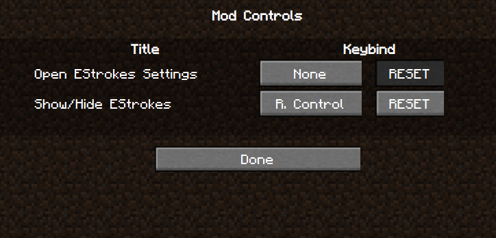

# ClassicBinds
## Eaglerforge's keybind manager

ClassicBinds is a library mod for Eaglerforge that allows mods to set their keybinds in a centralized place using a simple API



ClassicBinds is full rewrite of the [now retired] UniBinds to TypeScript.

## Installing

### Method 1 (online) [autoupdates but only works when you are online]

```
URL GOES HERE
```

1. Copy the URL above
2. Open EaglerForge (download EaglerForge)
3. On the title screen, click "Mods"
4. Click "Add New" and paste the mod's url
5. Click "Refresh ui"
6. Repeat for any Dependencies of the mod

**OR**

### Method 2 (local) [works offline but you have to update yourself]
1. Download the mod from the Releases page
2. Open EaglerForge (download [EaglerForge](https://github.com/eaglerforge/EaglerForge-builds/releases/latest))
3. On the title screen, click "Mods"
4. Click "Upload" and select the mod's ".js" file
5. Click "Refresh ui"
6. Repeat for any Dependencies of the mod
7. To update a mod, repeat these steps

## How to use (for players)

Go to your vanilla Controls menu, then press the "Open Mod Controls" button. The rest is self explanatory.

## Docs

```ts
ClassicBinds.addKeybind(_title:string, _code:string, _defaultBind:string="NONE")
```
Adds a keybind (where _code is a string containing js code, and _defaultBind is a LWJGL key name)

```ts
UKeys.setKeybind(_title:string, _bind="NONE")
```

Force sets a keybind (where _bind is a LWJGL key name)

```ts
UKeys.removeKeybind(_title)
```
Removes a keybind